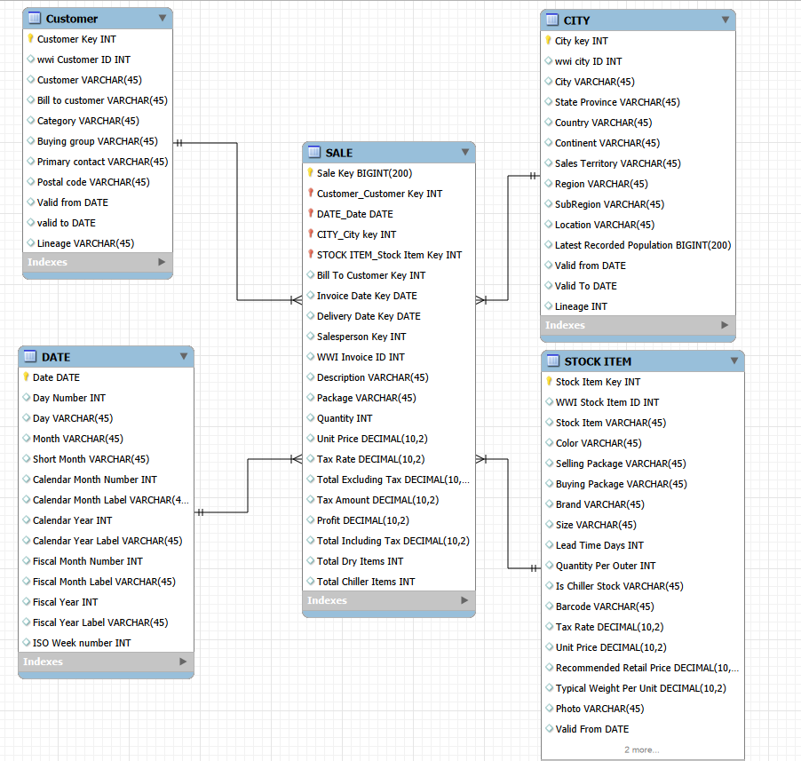

# Retail-sales-analysis
End-to-end retail sales analysis using SQL Server, WideWorldImportersDW and Power BI.

# Retail Sales Analysis - WideWorldImportersDW

## Project Overview

This project analyzes retail sales data from Microsoft's WideWorldImportersDW database.

The objective is to transform raw transactional data into actionable business insights through SQL analysis and interactive Power BI dashboards.

The project follows a complete analytics workflow:

1. Business Understanding
2. Data Exploration
3. Document data model
4. Data Analysis with SQL
5. Dashboard Creation in Power BI
6. Insights and Recommendations

---

## Business Problem

A retail company wants to better understand its sales performance, customer behavior, product performance, and geographic distribution of revenue.

The goal is to identify opportunities for growth and support data-driven decision-making.

---

## Business Questions

The analysis aims to answer the following questions:

- How have sales evolved over time?
- Which products generate the highest revenue?
- Which customers contribute the most revenue?
- Which cities generate the highest sales?
- Are there seasonal sales patterns?
- Which product categories perform best?
- What percentage of revenue comes from top customers?

---

## Dataset

Database: WideWorldImportersDW

WideWorldImportersDW is Microsoft's sample data warehouse designed for Business Intelligence and analytics scenarios.

---

## Tools Used

- SQL Server
- SQL Server Management Studio (SSMS)
- Power BI
- GitHub

---

## Project Structure

```text
retail-sales-analysis/
│
├── SQL/
├── Data_Model/
├── PowerBI/
├── Documentation/
└── Images/
```

---

## Project Roadmap

### Phase 1 - Business Understanding 
- Define business objectives
- Define key business questions

##Phase 2 - Data Exploration <a href="./SQL"></a>
- Identify fact tables
- Identify dimension tables
- Understand relationships
- Document data model

###Phase 3 - Document data model <a href="./DataModel"></a>

Fact.Sale
    │
    ├── Dimension.Customer
    ├── Dimension.Stock Item
    ├── Dimension.City
    └── Dimension.Date


        
The analytical model was designed after exploring the WideWorldImportersDW data warehouse. Fact.Sale was selected as the central fact table due to its historical sales information and its relationships with customer, product, geography and date dimensions

###Phase 4 - SQL Analysis <a href="./SQL"></a>
- Sales analysis
- Customer analysis
- Product analysis
- Geographic analysis
- KPI calculation

###Phase 5 - Dashboard Development <a href="./Power BI"></a>
- Executive dashboard
- Sales dashboard
- Customer dashboard

### Phase 6 - Insights & Recommendations
- Identify trends
- Generate business recommendations
- Present findings

---

## Current Status

🚧 Project In Progress

Completed:
- Initial data exploration
- Data model documentation
- Identification of analytical tables


In Progress:

- KPIs definition

---

## Future Deliverables

- SQL analysis scripts (can be found in the `SQL` folder.)
- The SQL phase began with an exploration of the WideWorldImportersDW data warehouse structure, including:
        
  - Schema identification
  - Table inventory
  - Column inspection
  - Row count analysis
  - Identification of key fields


- Power BI dashboard
- Business insights report
- Recommendations for decision-making

